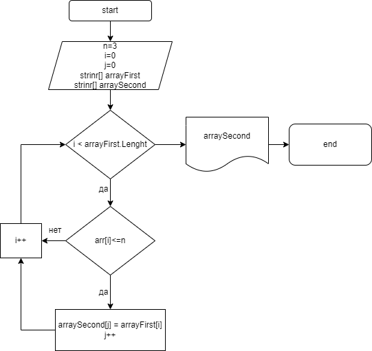

# Контрольная работа по блоку

## Задача :

Написать программу, которая выбирает из имеющегося массива из строк, длинна которых меньше либо равна 3 символам. Создает новый массив.

При решении не рекомендуется пользоваться коллекциями, лучше обойтись исключительно массивами.

## Алгоритм 
1. Создал массив
2. Создал методы заполнения и вывода на экран
3. Создал метод, который определяет длину нового сассива
4. Создал метод, который пишет о несоответствии данных, если нужных элементов нет
5. Создал метод, заполняющий новый массив, и выводит на экран

# Блок- схема в папке Diam

